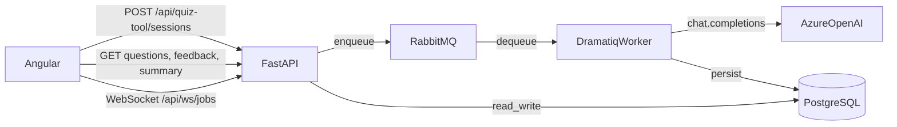
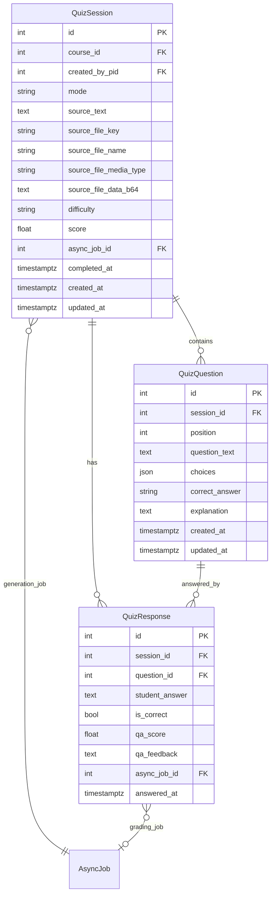

# Quiz Generator

The Quiz Generator lets students turn their own study material into a 10-question practice quiz. You pick a format, paste notes or upload a PDF, and the system generates questions in the background using Azure OpenAI and a Dramatiq worker. The sections below cover how it all fits together, from the Angular component down through the API, database, and AI prompts.

## Authors

| Name | GitHub |
|------|--------|
| Braeden Poole | [braedenpoole](https://github.com/braedenpoole) |
| Chris Butcher | [cbutcherunc](https://github.com/cbutcherunc) |
| Lalith Reddy | [lalithunc](https://github.com/lalithunc) |
| Neel Joshi | [nbjoshi](https://github.com/nbjoshi) |

## Overview

The quiz generator supports three modes:

| Mode | Code | How it works |
|------|------|--------------|
| Multiple choice | `mc` | 10 questions, each with four labeled choices (A–D). Correct answer stored as the letter. |
| True / false | `tf` | 10 questions, two choices each. Correct answer is `"True"` or `"False"`. |
| Q&A (open-ended) | `qa` | 10 questions with no choices. The student writes a free-text answer, and a second LLM call scores it 0–10 with structured feedback. |

For multiple-choice and true/false quizzes, the app checks correctness immediately on the client and computes a percentage score locally when you finish the last question. The backend summary route is called in the background to persist the score to the database, but the student sees results instantly without waiting for that round trip. For Q&A, each submitted answer triggers a background grading job; the frontend collects per-question feedback as it arrives and aggregates the scores into a client-side summary with the option to retry weak answers.

Question generation and Q&A grading both happen asynchronously. When you hit "Generate quiz", the API creates a database row, drops a job onto RabbitMQ, and returns immediately. The Dramatiq worker picks up the job, calls Azure OpenAI, parses the JSON response, and writes the questions to PostgreSQL. The browser finds out when the job finishes through a WebSocket connection (`/api/ws/jobs`), with HTTP polling every 3 seconds as a fallback.

## How a request moves through the system



Here is the sequence for a typical multiple-choice quiz session:

1. The student fills in study material and clicks **Generate quiz**. The Angular component sends a `POST /api/quiz-tool/sessions` with multipart form data.
2. The FastAPI route creates a `QuizSession` row and an `AsyncJob` row, enqueues a `QuizGenerationJob` onto RabbitMQ, and returns the `session_id` and `async_job_id`.
3. The Dramatiq worker dequeues the job, loads the session from the database, builds a prompt, and calls Azure OpenAI with `response_format: json_object`.
4. The worker validates the LLM's JSON output against Pydantic models, writes 10 `QuizQuestion` rows, and marks the `AsyncJob` as completed.
5. The frontend is listening on two channels. It subscribes to WebSocket updates for the `async_job_id`, and it also polls `GET /api/quiz-tool/sessions/{id}/questions` every 3 seconds. Whichever fires first loads the questions and shows the quiz.
6. As the student answers each question, the frontend sends `POST /api/quiz-tool/sessions/{id}/responses`. For `mc`/`tf`, the service compares the answer to the stored correct answer and records `is_correct`. For `qa`, the service instead creates another `AsyncJob` and enqueues a `QaGradingJob`.
7. After the last question, the frontend builds the summary locally from in-memory answers (for all modes). For `mc`/`tf` it also calls `GET /api/quiz-tool/sessions/{id}/summary` in the background to persist the score to the database. For `qa` there is no backend summary route; the frontend aggregates per-question feedback scores on its own.

---

## Frontend

**Source files:**

| File | Purpose |
|------|---------|
| [`app.routes.ts`](../frontend/src/app/app.routes.ts) | Registers the lazy-loaded route at `courses/:id/activities/quiz-generator` |
| [`quiz-generator.component.ts`](../frontend/src/app/courses/course-detail/activities/quiz-generator/quiz-generator.component.ts) | All component logic: signals, form, API calls, job watchers |
| `quiz-generator.component.html` | Template with `@if`/`@for` control flow for each view |
| `quiz-generator.component.scss` | Styles for cards, progress bar, feedback panels, summary ring |
| [`job-update.service.ts`](../frontend/src/app/job-update.service.ts) | Shared WebSocket service for real-time `AsyncJob` status |

### Component state machine

The `view` signal controls which screen the user sees. It transitions like this:

```
form  ──(generate)──>  quiz  ──(finish last question)──>  summary     (mc/tf)
                                                      ──>  qa-summary  (qa)
```

- **`form`** shows the format picker (three cards for MC, T/F, Q&A), a drag-and-drop zone for a **PDF** file, and a paste textarea. The "Generate quiz" button is disabled until the student provides at least one source of material (text and/or PDF).
- **`quiz`** renders a progress bar, a badge indicating the mode, the question text, and mode-specific answer controls. For MC it is four buttons labeled A–D; for T/F it is two large TRUE/FALSE buttons; for Q&A it is a textarea with a 500-word limit.
- **`summary`** displays the percentage score, correct/incorrect/unanswered counts, and a clickable question breakdown. The score is computed locally from in-memory answers for instant display; the backend summary call runs in the background only to persist the score. Each question links back to the quiz view in review mode, where the student can see the correct answer and explanation.
- **`qa-summary`** uses an SVG ring chart to show the overall percentage, boxes for "Strong (7+)" vs "Needs review", and a per-question score list with colored bars. If any questions scored below 7, a "Retry weak answers" button appears.

### URL-driven navigation

The component stores quiz state in query parameters so that refreshing the page or sharing a link lands on the right screen. The parameters are `session` (session ID), `screen` (`quiz` or `summary`), `q` (1-based question position), and `review` (set to `1` when reviewing from the summary). Angular `effect()` blocks keep the signals in sync with the URL.

### Real-time job monitoring

When the component initializes, it calls `jobUpdateService.subscribe(courseId)` to open a WebSocket. After creating a session, it calls `watchGenerationJob(asyncJobId)`, which creates an `effect` that reads the `updateForJob(asyncJobId)` signal. When the WebSocket reports `"completed"`, the effect cancels the poll timer and immediately fetches questions. If the status is `"failed"`, it shows an error message.

Q&A grading uses the same pattern. When `submitSessionResponse` returns an `async_job_id`, the component calls `watchQaJob(asyncJobId, responseId, questionId)`. When grading finishes, it fetches the feedback and updates the `qaFeedbackMap` signal. If no `async_job_id` comes back for some reason, the component falls back to polling `getResponseFeedback` every 3 seconds.

While a job is in progress, the UI rotates through loading messages like "Reading your notes...", "Drafting questions...", "Checking clarity...", and "Finalizing your quiz..." to make the wait feel shorter. Q&A grading has its own set: "Reviewing your answer...", "Scoring key ideas...", and so on. These rotate every 1.8 seconds.

---

## API routes

All quiz routes live on the `APIRouter` with prefix `/quiz-tool` in [`api/src/api/routes/quiz_tool.py`](../api/src/api/routes/quiz_tool.py). The app mounts all routers under `/api`, so the full browser paths start with `/api/quiz-tool/`.

| Method | Path | Status | Purpose |
|--------|------|--------|---------|
| `POST` | `/sessions` | 201 | Create a quiz session and enqueue generation |
| `GET` | `/sessions/{session_id}/questions` | 200 | List the generated questions (empty until the job finishes) |
| `POST` | `/sessions/{session_id}/responses` | 201 | Record one student answer |
| `GET` | `/responses/{response_id}/feedback` | 200 | Get Q&A grading status and structured feedback |
| `GET` | `/sessions/{session_id}/summary` | 200 | Get the final score for MC/TF (returns 409 if questions are not ready) |

### `POST /sessions` (create session)

This is a **multipart form** endpoint, not JSON. The form fields are:

| Field | Type | Required | Notes |
|-------|------|----------|-------|
| `course_id` | int | yes | Must be > 0 |
| `mode` | string | yes | One of `mc`, `tf`, `qa` |
| `difficulty` | string | no | One of `easy`, `medium`, `hard`. The UI does not send this today, so the worker defaults to `medium`. |
| `source_text` | string | no | Up to 100,000 characters of pasted notes |
| `source_file` | file | no | PDF only (validated by extension, not MIME type) |

At least one of `source_text` or `source_file` must be present. The route reads the uploaded file, base64-encodes it, and stores it in the `QuizSession` row so the worker can forward it to the LLM without touching the filesystem.

The response is:

```python
class SessionCreateResponse(BaseModel):
    session_id: int
    async_job_id: int
```

### `GET /sessions/{session_id}/questions`

Returns a list of `QuestionResponse` objects ordered by `position`. If the generation job has not finished yet, this returns an empty list rather than an error, which is what the frontend polls for.

```python
class QuestionResponse(BaseModel):
    id: int
    position: int
    question_text: str
    choices: Optional[list[dict[str, Any]]]  # null for Q&A mode
    correct_answer: str
    explanation: Optional[str]
```

### `POST /sessions/{session_id}/responses`

Submits one answer. The request body is JSON:

```python
class ResponseCreateRequest(BaseModel):
    question_id: int = Field(..., gt=0)
    student_answer: str = Field(..., min_length=1, max_length=10_000)
```

The response includes `async_job_id` when the mode is `qa`, because grading runs as a background job:

```python
class QuizResponseResponse(BaseModel):
    id: int
    session_id: int
    question_id: int
    student_answer: str
    is_correct: Optional[bool]     # set immediately for mc/tf, null for qa
    answered_at: datetime
    async_job_id: Optional[int]    # present for qa grading jobs
```

### `GET /responses/{response_id}/feedback`

Returns AI grading feedback for a Q&A answer. When grading is still running, `status` is `"pending"` and the other fields are null. When it finishes, `status` is `"complete"` and all fields are populated:

```python
class QaFeedbackResponse(BaseModel):
    response_id: int
    status: str                          # "pending" or "complete"
    qa_score: Optional[float]            # 0.0 to 1.0
    headline: Optional[str]              # e.g. "Solid grasp with minor gaps"
    what_got_right: Optional[str]
    what_to_improve: Optional[str]
    model_answer: Optional[str]
```

### `GET /sessions/{session_id}/summary`

Computes the final score for MC/TF quizzes and persists it to the `QuizSession` row. The frontend calls this in the background after it has already shown the locally-computed summary, so the student does not wait for this response. It also serves as a fallback: if a student revisits a session URL later, the frontend fetches the summary from the server since the in-memory answers are gone. Returns 409 if questions have not been generated yet, and 400 if the mode is `qa`.

```python
class QuizSummaryResponse(BaseModel):
    session_id: int
    total_questions: int
    correct_questions: int
    score: int                           # integer percentage, e.g. 80
    question_results: list[QuestionResultSummary]

class QuestionResultSummary(BaseModel):
    question_id: int
    position: int
    question_text: str
    correct_answer: str
    student_answer: Optional[str]
    is_correct: Optional[bool]
```

All request and response models are defined in [`api/src/api/models/quiz_tool.py`](../api/src/api/models/quiz_tool.py). `ALLOWED_QUIZ_FILE_TYPES` maps `.pdf` to `application/pdf`—only that extension is accepted for uploads.

On the Angular side, import domain type aliases from [`frontend/src/app/api/models.ts`](../frontend/src/app/api/models.ts) (e.g. `QuizQuestion`, `QuizSummary`, `QaFeedback`) and use the generated endpoint functions in `frontend/src/app/api/generated/fn/quiz-tool/`.

---

## Service layer

The business logic for the quiz tool lives in `QuizToolService` at [`packages/learnwithai-core/src/learnwithai/services/quiz_tool_service.py`](../packages/learnwithai-core/src/learnwithai/services/quiz_tool_service.py). The service constructor takes five dependencies: three repositories (`QuizSessionRepository`, `QuizQuestionRepository`, `QuizResponseRepository`), an `AsyncJobRepository`, and a `JobQueue`. FastAPI's dependency injection assembles these through the `quiz_tool_service_factory` in [`api/src/api/di.py`](../api/src/api/di.py).

The service has five public methods:

**`create_session`** checks that the student provided at least text or a file, creates an `AsyncJob` with `kind=quiz_generation` and status `PENDING`, creates a `QuizSession` linked to it, and enqueues a `QuizGenerationJob`. It returns the session ID and async job ID so the route can pass them to the frontend.

**`get_questions`** verifies that the session exists and belongs to the requesting user, then returns all questions ordered by position. If generation has not finished, this returns an empty list.

**`submit_response`** handles all three modes. For `qa`, it upserts a `QuizResponse` row (creating or updating if the student re-answers), creates a new `AsyncJob` with `kind=qa_grading`, links it to the response via `async_job_id`, and enqueues a `QaGradingJob`. For `mc` and `tf`, it compares the student's answer to `QuizQuestion.correct_answer` using a case-insensitive, whitespace-stripped comparison and writes `is_correct` directly.

**`get_qa_feedback`** reads `qa_score` and `qa_feedback` from the `QuizResponse` row. If both are present, it parses the JSON in `qa_feedback` into separate fields (headline, what got right, what to improve, model answer) and returns status `"complete"`. Otherwise it returns `"pending"`.

**`get_summary`** is only valid for `mc` and `tf` sessions. It loads all questions and responses, builds a per-question result list, computes an integer percentage score, and writes the score and `completed_at` timestamp back to the `QuizSession`. The frontend typically calls this in the background after it has already shown a locally-computed summary, so the main purpose is persistence. It also serves as the data source when a student revisits a session URL and the in-memory state is gone.

The three repositories (`QuizSessionRepository`, `QuizQuestionRepository`, `QuizResponseRepository`) are thin wrappers over `BaseRepository` in [`packages/learnwithai-core/src/learnwithai/tools/quiz/repository.py`](../packages/learnwithai-core/src/learnwithai/tools/quiz/repository.py). They inherit standard CRUD and add quiz-specific queries like `list_by_session` (ordered by position or answered_at) and `get_by_async_job_id`.

---

## Database tables

The quiz tool adds three tables to PostgreSQL, all prefixed with `quiz_tool__`. They are defined as SQLModel classes in [`packages/learnwithai-core/src/learnwithai/tables/quiz_tool.py`](../packages/learnwithai-core/src/learnwithai/tables/quiz_tool.py).



### `quiz_tool__session`

Each row is one quiz attempt. The `mode` column stores `mc`, `tf`, or `qa`. Source material lives directly on the row: `source_text` holds pasted content, and `source_file_data_b64` holds the base64-encoded bytes of an uploaded file. Storing the file inline means the background worker can send it to the LLM without touching external storage or the filesystem. `async_job_id` links to the generation job so the worker can find the session from the job payload. `score` and `completed_at` are written when the student finishes a MC/TF quiz.

### `quiz_tool__question`

One row per generated question, linked to a session. `position` determines the display order (1-based). `choices` is a JSON column that holds an array like `[{"label": "A", "text": "..."}, ...]` for MC/TF and is null for Q&A. `correct_answer` is a letter for MC, `"True"`/`"False"` for TF, or a full model answer for Q&A. `explanation` is a short justification the LLM provides alongside each question.

### `quiz_tool__response`

One row per student answer. For MC/TF, `is_correct` is set immediately when the answer is submitted. For Q&A, `is_correct` stays null; instead `qa_score` (a float from 0.0 to 1.0) and `qa_feedback` (a JSON string with headline, what got right, what to improve, and model answer) are filled in by the grading worker. `async_job_id` links to the grading job. If the student re-answers a Q&A question, the service clears the old feedback, creates a new `AsyncJob`, and updates `async_job_id`. The grading handler checks whether its job ID still matches the response's `async_job_id`; if it does not, the job was superseded and the handler marks itself completed without doing any work.

---

## AI integration

Both the quiz generation and Q&A grading jobs use `AiCompletionService` in [`packages/learnwithai-core/src/learnwithai/services/ai_completion_service.py`](../packages/learnwithai-core/src/learnwithai/services/ai_completion_service.py). This is a thin wrapper around the `openai.AzureOpenAI` client. It reads connection details from environment variables:

| Setting | Env var (either works) | Default |
|---------|----------------------|---------|
| API key | `OPENAI_API_KEY` / `AZURE_OPENAI_API_KEY` | *(none, required)* |
| Deployment | `OPENAI_MODEL` / `AZURE_OPENAI_DEPLOYMENT` | `gpt-5-mini` |
| Endpoint | `OPENAI_ENDPOINT` / `AZURE_OPENAI_ENDPOINT` | `https://azureaiapi.cloud.unc.edu` |
| API version | `OPENAI_API_VERSION` / `AZURE_OPENAI_API_VERSION` | `2025-04-01-preview` |

The `complete()` method sends a system message and a user message. When the session includes an uploaded file, the user message becomes a list of content blocks: one `file` block per attachment (with the base64 data URL) followed by a `text` block with the user prompt. Both handlers request `response_format={"type": "json_object"}` so the model returns parseable JSON.

### Quiz generation prompt

The generation handler lives in [`packages/learnwithai-core/src/learnwithai/tools/quiz/job.py`](../packages/learnwithai-core/src/learnwithai/tools/quiz/job.py). The system prompt tells the model it is "an expert instructional designer" and instructs it to produce exactly 10 questions at a given difficulty and mode. It specifies the exact JSON shape: an object with a `questions` array, where each entry has `question_text`, `choices` (with labels and text), `correct_answer`, and `explanation`. The prompt also asks for conciseness: at most two short sentences per explanation.

The user prompt varies depending on what the student provided. If both text and a file were uploaded, the prompt says "Use the attached file and the following pasted text as study material." If only text was pasted, it is sent directly as the user message. If only a file was uploaded, the prompt says "Generate the quiz from the attached file."

The LLM's JSON response is validated against `GeneratedQuiz` and `GeneratedQuestion` Pydantic models in [`tools/quiz/models.py`](../packages/learnwithai-core/src/learnwithai/tools/quiz/models.py). If parsing fails or zero questions come back, the handler raises an error and the job is marked as failed. The constant `QUIZ_QUESTION_COUNT` is set to 10.

### Q&A grading prompt

The grading handler lives in [`packages/learnwithai-core/src/learnwithai/tools/quiz/qa_grading_job.py`](../packages/learnwithai-core/src/learnwithai/tools/quiz/qa_grading_job.py). The system prompt defines a rubric:

| Score | Meaning |
|-------|---------|
| 9–10 | Thorough, accurate, well-explained |
| 7–8 | Good answer with minor gaps |
| 5–6 | Partial understanding |
| 3–4 | Limited understanding |
| 0–2 | Insufficient or irrelevant |

The model returns a JSON object with `score` (integer 0–10), `headline`, `what_got_right`, `what_to_improve`, and `model_answer`. The user prompt contains the question text, the stored model answer from `QuizQuestion.correct_answer`, and the student's submitted text. The handler divides the score by 10 and stores it as a float in `qa_score`, then JSON-serializes the text fields into `qa_feedback`.

---

## Background jobs

The quiz tool registers two job types in the shared job system at [`packages/learnwithai-core/src/learnwithai/jobs/__init__.py`](../packages/learnwithai-core/src/learnwithai/jobs/__init__.py):

| Job type | Payload class | Handler class | `AsyncJob.kind` |
|----------|---------------|---------------|-----------------|
| Quiz generation | `QuizGenerationJob` | `QuizGenerationJobHandler` | `quiz_generation` |
| Q&A grading | `QaGradingJob` | `QaGradingJobHandler` | `qa_grading` |

Both payload classes extend `TrackedJob`, which carries a `job_id` that maps to an `AsyncJob` row. `QaGradingJob` also includes `response_id` so the handler knows which `QuizResponse` to update.

Jobs are enqueued through the shared `JobQueue` interface. The Dramatiq worker process, which runs separately from the API, consumes from RabbitMQ and dispatches to the right handler based on the `type` discriminator in the payload.

When a job completes or fails, the WebSocket system pushes status updates to any frontends that called `subscribe(courseId)`. This is what lets the quiz UI react immediately instead of waiting for the next poll cycle.

---

## Using the quiz generator (user walkthrough)

### Setting up a quiz

When you navigate to the Quiz Generator inside a course, you see the configuration screen. At the top are three format cards: **Multiple choice** ("10 questions, 4 options A–D"), **True / False** ("10 questions, T or F only"), and **Q&A** ("10 questions, open-ended answers"). Clicking a card selects that format.

Below the format picker is the study materials section. You can drag and drop a **PDF** onto the dropzone, or click it to open a file browser (PDF only). There is also an "or paste text" divider with a textarea where you can paste notes directly. You can use both a PDF and pasted text together; the LLM receives both as context.


### Generating questions

Once you have selected a format and provided at least one source of material, the "Generate quiz" button becomes active. Clicking it sends the request, and you see a loading state with rotating progress messages: "Reading your notes...", "Drafting questions...", "Checking clarity...", "Finalizing your quiz...". These messages cycle every 1.8 seconds while the background job runs.


### Answering multiple-choice questions

After generation finishes, you land on the quiz screen. A progress bar at the top shows your position (e.g. "3 / 10"). A badge indicates the mode ("Multiple choice"), followed by the question text and four answer buttons. Each button shows the choice label (A, B, C, D) and the answer text.


### Getting immediate feedback

When you click an answer, the correct option highlights in green and your wrong pick (if applicable) highlights in red. Below the options, a feedback panel appears with a verdict ("Correct!" or "Incorrect") and an EXPLANATION section with the LLM-generated justification. A "Next question" button moves you forward. You can also skip a question without answering.


### Reviewing your score (MC/TF)

After the last question, you see the Quiz Summary. It shows your percentage score at the top, followed by counts of correct, incorrect, and unanswered questions. Below that is a QUESTION BREAKDOWN list where each question is a link. Clicking one takes you back to that question in review mode, where you can see the correct answer and explanation regardless of whether you answered it. A "Start over" button resets the component so you can generate a new quiz.


### Writing a Q&A answer

In Q&A mode, the quiz screen shows a "Written response" badge instead of multiple-choice options. Below the question text is a large textarea with the placeholder "Write your answer here in your own words...". A TIP note encourages detailed responses: "Explain as if you're teaching someone — the more detail, the better your score." A word counter in the bottom-right tracks your usage against the 500-word limit. The "Submit answer" button sends your response for grading.


### Receiving AI feedback

After submitting a Q&A answer, the button changes to "Evaluating..." while the grading job runs. When feedback arrives, a result card appears showing your score out of 10 with a label (e.g. "Great answer!" for 7+), a headline, sections for "What you got right" and "What to improve" (or "What was missing" for scores below 7), and a MODEL ANSWER showing what a complete response looks like. Only after feedback loads does the "Next question" button become clickable.


### Q&A summary and retrying weak answers

After all 10 Q&A questions, you reach the Q&A summary screen. A ring chart shows your overall percentage. Two boxes summarize how many questions were "Strong (7+)" versus "Needs review (6 or below)." Below that, a QUESTION BREAKDOWN list shows each question with a score badge (color-coded green, amber, or red), the question text, a proportional bar, and the numeric score. If any questions scored below 7, a "Retry weak answers" button filters the quiz down to just those questions so you can re-answer them. A "New quiz" button starts fresh.


---

## Extending the quiz tool

If you need to change or build on this feature, the table below points you to the right files:

| What you want to change | Where to look |
|--------------------------|---------------|
| UI layout, navigation, or poll intervals | [`quiz-generator.component.ts`](../frontend/src/app/courses/course-detail/activities/quiz-generator/quiz-generator.component.ts) and its template/styles |
| API validation or new endpoints | [`api/src/api/routes/quiz_tool.py`](../api/src/api/routes/quiz_tool.py) and [`api/src/api/models/quiz_tool.py`](../api/src/api/models/quiz_tool.py) |
| Business logic or authorization | [`quiz_tool_service.py`](../packages/learnwithai-core/src/learnwithai/services/quiz_tool_service.py) |
| Generation prompt or question count | [`tools/quiz/job.py`](../packages/learnwithai-core/src/learnwithai/tools/quiz/job.py) and [`tools/quiz/models.py`](../packages/learnwithai-core/src/learnwithai/tools/quiz/models.py) |
| Q&A grading rubric or feedback fields | [`tools/quiz/qa_grading_job.py`](../packages/learnwithai-core/src/learnwithai/tools/quiz/qa_grading_job.py) |
| Database columns or new tables | [`tables/quiz_tool.py`](../packages/learnwithai-core/src/learnwithai/tables/quiz_tool.py) + reset scripts in `packages/learnwithai-core/scripts/` |

If you change the API contract (add fields, rename routes, etc.), run `pnpm api:sync` from the `frontend/` directory to regenerate the TypeScript client. Do not hand-edit files in `src/app/api/generated/`.
